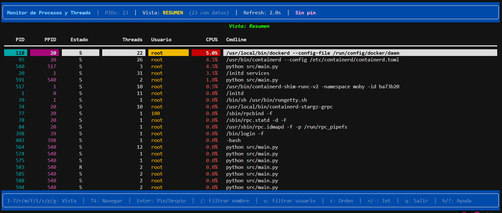
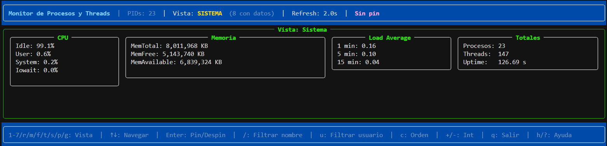

# TP1 - Monitor de Procesos y Threads

## 1. Descripción general

Este proyecto es un monitor del sistema en tiempo real para Linux desarrollado en Python 3.11+, similar a herramientas clásicas como `htop`. Su propósito es analizar en profundidad la anatomía interna de los procesos del sistema leyendo la información directamente desde el pseudo-sistema de archivos `/proc`, sin depender de librerías externas que abstraigan el kernel (como `psutil`).

El monitor extrae y muestra:
- Información general de procesos (PID, PPID, estado, memoria, CPU%).
- Detalles de la memoria virtual, consumos de segmentos y page faults.
- File Descriptors (FDs) abiertos y sus destinos.
- Threads o Lightweight Processes (LWPs) que pertenecen a cada proceso.
- Señales pendientes, bloqueadas e ignoradas.
- Información del planificador (scheduler) incluyendo prioridades y context switches.
- Estadísticas globales del sistema.

Todo esto se presenta mediante una Interfaz de Usuario de Texto (TUI) con 7 vistas alternables.

## 2. Diagrama de Arquitectura

El sistema implementa una arquitectura multiproceso donde distintos "Analizadores" especializados corren en paralelo:

```text
       ┌──────────────────────────────────────┐
       │           SNAPSHOT GLOBAL            │
       │      (Manager dict compartido)       │
       │  ┌─────────────────────────────────┐ │
       │  │ "resumen"   : {...}  ts: ...    │ │
       │  │ "memoria"   : {...}  ts: ...    │ │
       │  │ "fds"       : {...}  ts: ...    │ │
       │  │ "threads"   : {...}  ts: ...    │ │
       │  │ "senales"   : {...}  ts: ...    │ │
       │  │ "scheduling": {...}  ts: ...    │ │
       │  │ "sistema"   : {...}  ts: ...    │ │
       │  └─────────────────────────────────┘ │
       └────────▲─────────────────────▲───────┘
                │ escriben            │ lee
   ┌────────────┼─────────┬──────────┴────────┐
   │            │         │                   │
┌──▼──────┐ ┌───▼─────┐ ┌─▼──────┐       ┌────▼─────┐
│Resumen  │ │Memoria  │ │FDs     │  ...  │ Display  │
│cada 2s  │ │cada 3s  │ │cada 5s │       │ TUI      │
└─────────┘ └─────────┘ └────────┘       └──────────┘
```

1. **Recolector**: Proceso encargado exclusivamente de listar los procesos activos desde `/proc`.
2. **Analizadores (7)**: Extraen en paralelo las distintas aristas requeridas (Resumen, Memoria, FDs, etc.).
3. **Agregador**: Recibe la información de los analizadores por medio de una `Queue` y la vuelca de forma atómica en el Snapshot.
4. **Manager Snapshot**: Un diccionario interprocesos que aloja la última foto de las métricas.
5. **Display**: Hilo principal que ejecuta la TUI leyendo el Snapshot y reaccionando a los inputs del usuario.

## 3. Decisiones de diseño

### Mecanismos de IPC elegidos
- **Manager.dict() vs Value/Array**: Elegimos `Manager.dict()` para el Snapshot Global porque es extremadamente flexible para almacenar estructuras jerárquicas y dinámicas (diccionarios y listas no estáticos de tamaño variable como la cantidad de procesos). `Value` y `Array` obligan a usar tipos atómicos estáticos (int, double, char arrays) que son insuficientes para guardar métricas complejas de memoria o listas de strings (señales, destinos de symlinks de FDs, etc).
- **Queue para agregación**: Para que 7 procesos distintos no compitan por el lock de escritura constante en el `Manager.dict()`, implementamos un proceso `Agregador`. Los analizadores mandan diccionarios JSON por una `Queue`, y el Agregador es el único que bloquea el lock del snapshot para mutarlo de un solo golpe.

### Prevención de Race Conditions
- Se implementó un `multiprocessing.Lock` para que el `Agregador` asegure transaccionalidad al escribir en el snapshot y actualizar su timestamp al mismo tiempo.
- En la TUI (Display), la lógica del hilo de lectura (que modifica variables o captura la entrada estándar) no colisiona con el hilo de actualización de la UI, dado que los cambios manuales forzan un `Event` de refresh o la TUI lee un diccionario que se modifica atómicamente debajo.

### Intervalos por defecto
Los intervalos elegidos intentan balancear la frescura de datos con la intensidad del procesador leyendo miles de archivos:
- **Resumen/Sistema (2s)**: Son métricas vitales; más de 2s las volvería toscas.
- **Señales y Scheduling (10s)**: Cambian con menor frecuencia y su parseo en Python para todos los PIDs genera latencia evitable.

## 4. Conceptos del curso aplicados

- **Zombies y fork**: Para identificar zombies en la vista, se mira el campo 3 (estado `Z`) en `/proc/<pid>/stat`, derivado de procesos que llamaron `exit()` pero su padre aún no ejecutó el `wait()`.
- **Señales (Signals) y Async-Signal-Safe**: El teclado responde rápidamente sin romper el loop de `rich` porque se implementó un `Self-Pipe` (`signal.set_wakeup_fd`). Esto permite usar `select()` y capturar señales entrantes fuera del signal handler puro de Python que suele presentar limitaciones.
- **Memoria Compartida y Mapeo**: Al extraer `/proc/<pid>/maps`, se agrupa la memoria de los procesos usando sus flags de permisos para identificar los segmentos de `[heap]`, `[stack]`, variables anónimas (`anon`), y archivos texto ejecutables (`.so` con permiso `x`).
- **Threads como LWPs**: En Linux, los threads corren bajo la abstracción de procesos livianos. Por ello listamos los threads no como entidades ajenas, sino recorriendo `/proc/<pid>/task/`, identificando allí cada sub-hilo con un TID específico y sus contadores de context switch (`voluntary_ctxt_switches`).

## 5. Limitaciones conocidas

- En procesos de sistema fuertemente restringidos (propios de `root`), algunas lecturas (especialmente `fd/` o `maps`) arrojan `PermissionError`. Estos procesos simplemente muestran información parcial o campos vacíos.
- El cálculo de uso de CPU `%` puede sufrir desviaciones muy pequeñas respecto a top/htop por no sincronizar estricta y globalmente los ticks del reloj del kernel con el reloj monolítico de los procesos en Python, pero aproxima correctamente la distribución de carga.

## 6. Cómo correr y testear

El programa requiere Linux para su ejecución plena debido al acoplamiento profundo con `/proc`. Utilice Docker para levantar el contenedor con privilegios y consola interactiva.

**Paso 1:** Construir la imagen y ejecutar el contenedor de forma interactiva (vital para que la TUI renderice sin parpadeos por los prefijos de logs de Docker):
```bash
docker compose build
docker compose run --rm monitor
```


> NOTA: Para salir limpio de la TUI, presione `q` (Quit) o envíe `Ctrl+C`.

**Señales de monitorización:**
Puede abrir otra terminal mientras el Docker está activo y mandarle señales al proceso principal del monitor para probar el reload de configuraciones o logs de estado:
```bash
# Refresca la configuración desde config.json
docker exec tp1_monitor kill -HUP 1 
# Hace dump de un Snapshot local al disco (JSON)
docker exec tp1_monitor kill -USR1 1 
```
